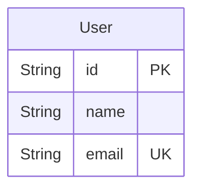

# ER図

> Generated by [`prisma-markdown`](https://github.com/samchon/prisma-markdown)

- [default](#default)

## default

```mermaid
erDiagram
"User" {
  String id PK
  String name
  String email UK
}
```

### `User`

Properties as follows:

- `id`:
- `name`:
- `email`:
